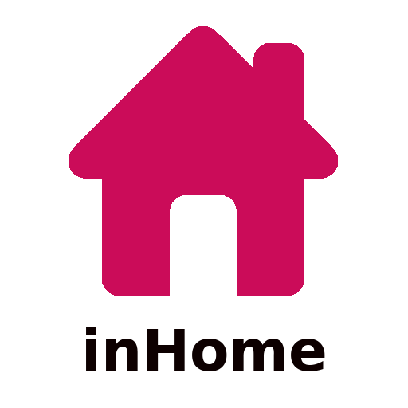

<h1 align="center">
    
</h1>

<h4 align="center"> 
	:construction: 🚀 inHome - in progress :construction:
</h4>

  

  
	
  

  

  
<a aria-label="In progress" href="">
  

  <a href="#-project">Project</a>&nbsp;&nbsp;&nbsp;|&nbsp;&nbsp;&nbsp;
  <a href="#rocket-Technologies">Technologies</a>&nbsp;&nbsp;&nbsp;|&nbsp;&nbsp;&nbsp;
  <a href="#-layout">Layout</a>&nbsp;&nbsp;&nbsp;|&nbsp;&nbsp;&nbsp;
  <a href="#-how-to-contribute">How to contribute</a>&nbsp;&nbsp;&nbsp;|&nbsp;&nbsp;&nbsp;
  <a href="#memo-license">License</a>

	inHome API are available in: <a href="https://inhome-backend.herokuapp.com">https://inhome-backend.herokuapp.com</a>

## 💻 Project

inHome is a project that allow users to control thermal confort equipaments by Internet of Things.

## :rocket: Technologies

This project was developed with the following technologies:

- [Node.js](https://nodejs.org/en/) 

## :wrench: How to use

The API are divided in two entities: 

#### Client
- List user data:
> - query params: id=USER_NAME 
`GET https://inhome-backend.herokuapp.com/users/list?id=USER_NAME`

- Logon in the application: 
> - body: JSON Object with "Username" and "Password" atributes. 
> example:

`{
	Username: "USERNAME",
	Password: "123456"
}` 
`GET https://inhome-backend.herokuapp.com/users`

- Create new user: 
> - body: JSON Object with "Username", "Password" and "ProfileImage" atributes. 
example: 
`{
	Username: "USERNAME",
	Password: "123456",
	ProfileImage: "www.minhafoto.com/minhafoto.png"
}` 
`POST https://inhome-backend.herokuapp.com/users`

#### Device
- Show user devices: 
> `GET https://inhome-backend.herokuapp.com/devices`

- Create a new device for user:
> - body: JSON Object with "DeviceID", "DeviceName", "ambient", "latitude" and "longitude" atributes. 
> `POST https://inhome-backend.herokuapp.com/devices`

-Update device data: 
* in development *

## 🤔 How to contribute

- Make a fork;
- Create a branck with your feature: `git checkout -b my-feature`;
- Commit changes: `git commit -m 'feat: My new feature'`;
- Make a push to your branch: `git push origin my-feature`.

After merging your receipt request to done, you can delete a branch from yours.

## :memo: License

This project is under the MIT license. See the [LICENSE](LICENSE.md) for details.

---

Made with ♥ by Elismar Silva :wave: [Get in touch!](https://www.linkedin.com/in/elismar-silva-644272191/)
